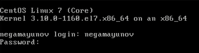
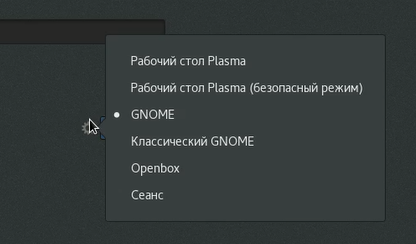

<!-- _class: titleslide -->
# Лабораторная работа №4
### Выполнил Гамаюнов Никита, 1032201719, НПМбд-01-20

---
# Прагматика выполнения работы
**Цель:** Познакомиться с операционной системой Linux, получить практические навыки работы с консолью и некоторыми графическими менеджерами рабочих столов операционной
системы.
**Задача:**  Применить теоретические знания на практике.

---

# Процесс выполнения лабораторной работы:
Загрузил компьютер, перешёл на текстовую консоль.
 

---

Перемещался между текстовыми консолями с помощью сочетаний клавиш **Alt+Fn**, где n - число от 1 до 6 - номер консоли (F7 позволяет переключиться в графический интерфейс)
Зарегистрировался в текстовой консоли, используя логин и пароль от учетной записи.

---
Завершил консольный сеанс, нажав комбинацию клавиш **Ctrl+D**.

Нажатием комбинации **Ctrl+Alt+F7** переключился в графический интерфейс

Ознакомился с менеджером рабочих столов. По умолчанию у меня запускается классический GNOME

 

---
Далее ознакомился с различными менеджерами рабочих столов и установленными на них программами, после чего завершил выполнение работы.

---

# Результаты выполнения лабораторной работы:
Я познакомился с операционной системой Linux, получил практические навыки работы с консолью и некоторыми графическими менеджерами рабочих столов операционной системы.