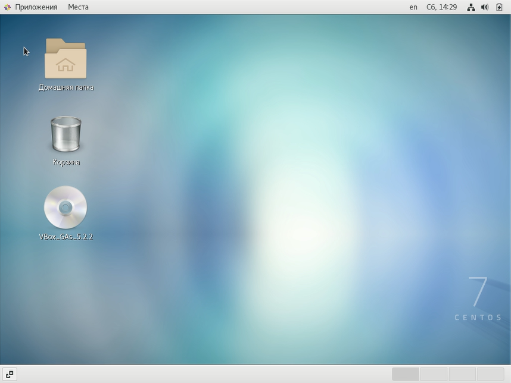

# Лабораторная работа №4
## По дисциплине Операционнные системы
### Выполнил Гамаюнов Н.Е., студент ФФМиЕН РУДН, НПМбд-01-20, 1032201717
### Преподаватель Кулябов Дмитрий Сергеевич
### Москва, 2021 г.

# Цель работы
Познакомиться с операционной системой Linux, получить практические навыки работы с консолью и некоторыми графическими менеджерами рабочих столов операционной
системы.

# Выполнение лабораторной работы
1. Ознакомился с теоретическими материалами
2. Загрузил компьютер:

3. Перешёл на текстовую консоль. Всего на моём компьютере их шесть.
 

4. Перемещался между текстовыми консолями с помощью сочетаний клавиш **Alt+Fn**, где n - число от 1 до 6 - номер консоли (F7 позволяет переключиться в графический интерфейс)
5. Зарегистрировался в текстовой консоли, используя логин и пароль от учетной записи.

    

    При вводе пароля символы не отображаются.

6. Завершил консольный сеанс, нажав комбинацию клавиш **Ctrl+D**.

7. Нажатием комбинации **Ctrl+Alt+F7** переключился в графический интерфейс
   
   

8. Ознакомился с менеджером рабочих столов. По умолчанию у меня запускается классический GNOME

    

9. Поочерёдно зарегистрировался в разных менеджерах рабочих столов: 

    

    *(KDE)*

    

    *(Xfce)*

    

    *(GNOME)*

    А также в оконном менеджере OpenBox:

    

10. Изучил список установленных программ, обратил внимание на избранные приложения:
    

    Поочерёдно запустил браузер Firefox, текстовый редактор (одноимённый), текстовый процессор KWrite и эмулятор консоли, - Konsole.
    

    

    

    

# Выводы
Я познакомился с операционной системой Linux, получил практические навыки работы с консолью и некоторыми графическими менеджерами рабочих столов операционной
системы.

# Ответы на контрольные вопросы
1. *Компьютерный терминал* — устройство ввода–вывода, основные функции которого заключаются в вводе и отображении данных. Я не думаю, что у него есть серьёзные преимущества перед графическим интерфейсом, но иногда (например, на серверных машинах) установка второго совсем не обязательна. Здесь вполне может пригодиться терминал.
2. *Входное имя пользователя*, или *логин (login)* - название учетной записи пользователя.
3. В файле */etc/shadow*, который недоступен для просмотра обычным пользователям. Поэтому пароли в нём имеют вид X.
4. В домашнем каталоге.
5. root.
6. Да, его права обычно не ограничены.
7. Пользователь с обычными правами может действовать только в рамках выделенного ему пространства, не влияя на работоспособность системы и/или других пользователей. А пользователи с правами администратора таких ограничений не имеют.
8. Внутренний идентификатор пользователя (User ID), идентификатор группы (Group ID), анкетные данные пользователя (General Information), домашний каталог (Home Dir), указатель на программную оболочку (Shell).
9. Идентификатор пользователя, Идентификатор группы.
10. Анкетные данные пользователя. Необязательный параметр учетной записи, в который могут быть записаны адрес, номер телефона и т.д.
11. Домашний каталог у каждого пользователя свой, обычно он недоступен другим пользователям. В нём хранятся данные программ, пользовательские файлы и настройки.
12. /home
13. Да, хотя домашний каталог пользователя и недоступен другим пользователям с обычными правами.
14. Пароли пользователей.
15. Если в поле пароля пользователя стоит *, пользователь не может войти в систему.
16. *Виртуальные консоли* — реализация концепции многотерминальной работы в рамках одного устройства.
На мой взгляд слово "виртаульные" здесь значит "возможные концептульно", ведь консоли позволяют переключаться между несколькоми терминалами, а значит, теоретически, реализовывать многопользовательскую работу.
17. Для управления доступом к терминалам (физическим и виртуальным).
18. Весь процесс взаимодействия с системой, начиная с регистрации в ней и заканчивая выходом из неё.
19. Кроссплатформенная библиотека базовых элементов графического интерфейса, распространяемая
с открытыми исходными текстами.
20.  - GTK+ (сокращение от GIMP Toolkit) — кроссплатформенная библиотека элементов
интерфейса;
     -  Qt — кроссплатформенный инструментарий разработки программного обеспечения
на языке программирования C++.